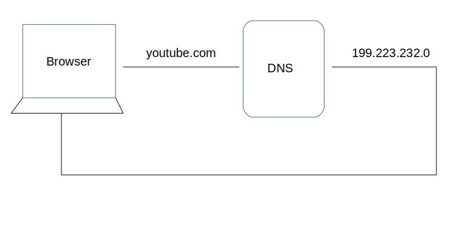
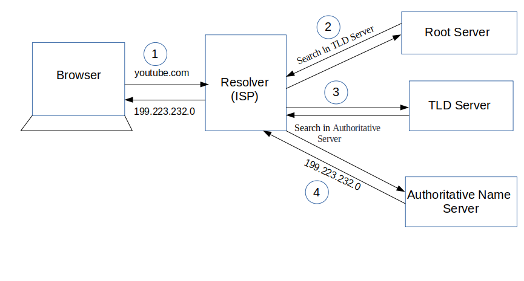
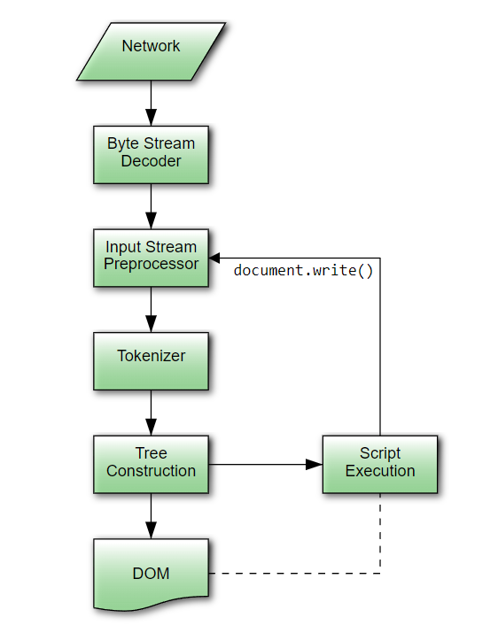

## Assignment 1.1

## Q.1] When a user enters an URL in the browser, how does the browser fetch the desiredresult ? Explain this with the below in mind and Demonstrate this by drawing a diagramfor the same.(2-3hours)

    a.What is the main functionality of the browser?
    b.High Level Components of a browser.
    c.Rendering engine and its use.
    d.Parsers (HTML, CSS, etc)
    e.Script Processors
    f.Tree construction
    g.Order of script processing
    h.Layout and Painting

## Answer

When user enters URL in browser, the first thing happen is, browser tries to find out the IP address associated with the domain name. DNS helps in resolving this. DNS is like a phone book and helps us to provide the IP address that is associated with the domain name just like our phone book gives a mobile number which is associated with the person’s name.

This is the overview, but there are four layers through which this domain name query goes through are:

1. After hitting the URL, the browser cache is checked. As browser maintains its DNS records for some amount of time for the websites we have visited earlier. Hence, firstly, DNS query runs here to find the IP address associated with the domain name.
2. The second place where DNS query runs in OS cache followed by router cache.
3. If in the above steps, a DNS query does not get resolved, then it takes the help of resolver server. Resolver server is nothing but your ISP (Internet service provider). The query is sent to ISP where DNS query runs in ISP cache.
4. If in 3rd steps as well, no results found, then request sends to top or root server of the DNS hierarchy. There it never happens that it says no results found, but actually it tells, from where this information you can get. If you are searching IP address of the top level domain (.com,.net,.Gov,. org). It tells the resolver server to search TLD server (Top level domain).
5. Now, resolver asks TLD server to give IP address of our domain name. TLD stores address information of domain name. It tells the resolver to ask it to Authoritative Name server.
6. The authoritative name server is responsible for knowing everything about the domain name. Finally, resolver (ISP) gets the IP address associated with the domain name and sends it back to the browser.
   After getting an IP address, resolver stores it in its cache so that next time, if the same query comes then it does not have to go to all these steps again. It can now provide IP address from their cache.
   This is all about the steps that is followed to resolve IP address that is associated with the domain name.
   

## The browser's main functionality

The main function of a browser is to present the web resource which we choose, by requesting it from the server and displaying it in the browser window. The resource is usually an HTML document, but may also be a PDF, image, or some other type of content. The location of the resource is specified by the user using a URI.

## The browser's high level components

a. The user interface: this includes the address bar, back/forward button, bookmarking menu, etc. Every part of the browser display except the window where we see the requested page.
b. The browser engine: marshals actions between the UI and the rendering engine.
c. The rendering engine: responsible for displaying requested content. For example if the requested content is HTML, the rendering engine parses HTML and CSS, and displays the parsed content on the screen.
d. Networking: for network calls such as HTTP requests, using different implementations for different platform behind a platform-independent interface.
e. UI backend: used for drawing basic widgets like combo boxes and windows. This backend exposes a generic interface that is not platform specific. Underneath it uses operating system user interface methods.
f. JavaScript interpreter: Used to parse and execute JavaScript code.
g. Data storage: This is a persistence layer. The browser may need to save all sorts of data locally, such as cookies. Browsers also support storage mechanisms such as localStorage, IndexedDB, WebSQL and FileSystem.

## The rendering engine

The responsibility of the rendering engine is rendering, that is display of the requested contents on the browser screen.
By default the rendering engine can display HTML and XML documents and images. It can display other types of data via plug-ins or extension; for example, displaying PDF documents using a PDF viewer plug-in. However, in this chapter we will focus on the main use case: displaying HTML and images that are formatted using CSS.

## Parsing

Parsing a document means translating it to a structure the code can use. The result of parsing is usually a tree of nodes that represent the structure of the document.
The job of the HTML parser is to parse the HTML markup into a parse tree.

## Script processor

The model of the web is synchronous. We expect scripts to be parsed and executed immediately when the parser reaches a script tag.
The parsing of the document halts until the script has been executed. If the script is external then the resource must first be fetched from the network - this is also done synchronously, and parsing halts until the resource is fetched. But, now a days we can add the "defer" attribute to a script, in which case it will not halt document parsing and will execute after the document is parsed. HTML5 adds an option to mark the script as asynchronous so it will be parsed and executed by a different thread.

## Tree Construction

While the DOM tree is being constructed, the browser constructs another tree, the render tree. This tree is of visual elements in the order in which they will be displayed. It is the visual representation of the document. The purpose of this tree is to enable painting the contents in their correct order.

## Layout and painting

When the renderer is created and added to the tree, it does not have a position and size. Calculating these values is called layout or reflow.
HTML uses a flow based layout model, meaning that most of the time it is possible to compute the geometry in a single pass. Elements later "in the flow" typically do not affect the geometry of elements that are earlier "in the flow", so layout can proceed left-to-right, top-to-bottom through the document. There are exceptions: for example, HTML tables may require more than one pass.

The coordinate system is relative to the root frame. Top and left coordinates are used.

Layout is a recursive process. It begins at the root renderer, which corresponds to the html element of the HTML document. Layout continues recursively through some or all of the frame hierarchy, computing geometric information for each renderer that requires it.
The position of the root renderer is 0,0 and its dimensions are the viewport - the visible part of the browser window.

All renderers have a "layout" or "reflow" method, each renderer invokes the layout method of its children that need layout.
